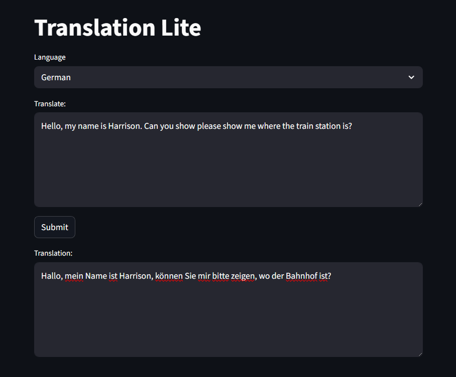

# translation-lite

A simple English -> X translation service.

## Service Architecture

### Model Server

The model server uses the `transformers` library to serve the [Facebook NLLB](https://huggingface.co/facebook/nllb-200-distilled-600M) model using Huggingface artifacts. The server is hosted with `uvicorn` and leverages `fastapi` to provide a inference API endpoint.

### Streamlit App

The app uses `streamlit` to deploy a lightweight dashboard, allowing a user to input English source text to the service, select the desired langauge, and view the corresponding translation.



## Quickstart Guide

Prerequisites:

- docker-compose

Serving:

```
make download
make serve
# make serve-gpu
```

## Development

- `make install` - installs Python packages for development
- `make download` - downloads model artifacts from Huggingface to the `./artifacts` directory
- `make serve` - build and serve the translation service at [http://localhost:8501](http://localhost:8501)
- `make serve` - build and serve the translation service at [http://localhost:8501](http://localhost:8501) with GPU

## Design Elements

All requirements for the service are built into containers, except for the model artifacts, which are mounted from the user's system to reduce the size of the container images. 

The repository includes a utility to download the required Huggingface artifacts. Mounting the artifacts allows the service to function in an offline environment.

The service is built and deployed using `docker compose`, allowing the service to be deployed on any machine with Docker Compose configured.

The server container leverages a Pytorch base image to reduce the burden of installing `pytorch`.
